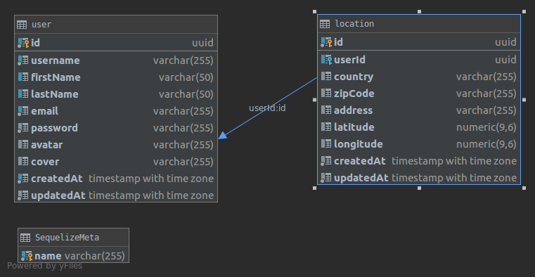

# GraphQL Architecture using Sequelize

## This repository is an example of back end architecture using GraphQL API using Sequelize ORM.

* main file is **index.js**

## Prerequisites

you need to have node installed in your OS

```
node v10.8.0
yarn v1.16.0
```

**install dependancies before using**

    yarn install


**The repository consists of two models: User and Location, and their relation. Also, the CRUD of each of the models.**

*below the image of user-location relation*



The reason why GraphQL is faster than REST API is that in GraphQL you can pick the fields you want to query. Therefore, the request will always be the smallest possible. Additionally, with GraphQL, you can enquire multiple entities in one request, so less bits will be transferred over the wire and the projects will perform faster compared to REST.
