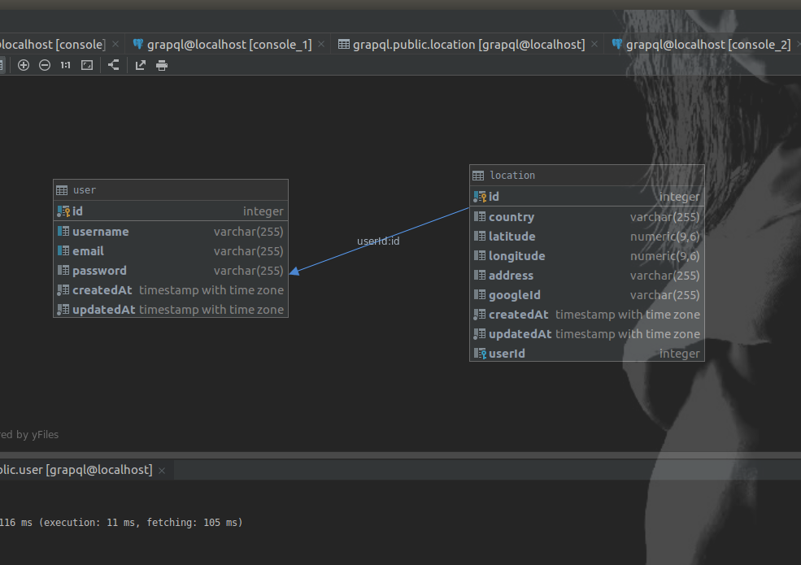

# graphql and sequelize

#### GraphQL is faster than REST because as you can pick the fields you want to query, so the request will always be the smallest possible. Additionally, with GraphQL, you can enquire multiple entities in one request, and because less bits will be transferred over the wire so your projects will perform faster than while using REST.

